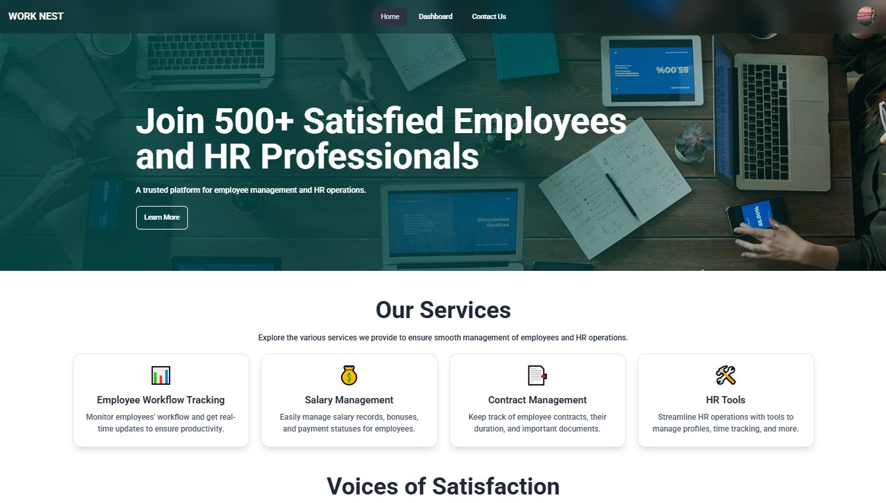

<h1>Work Nest</h1>

Welcome to <strong>Work Nest</strong>! This README provides key details about the website, including login credentials, features, and the live site URL.

<h2>Admin Credentials</h2>
<ul>
  <li><strong>Username:</strong> kobirul@gmail.com</li>
  <li><strong>Password:</strong> Kobirul23$</li>
</ul>

<h2>Live Site URL</h2>

You can access the live website at: <a href="https://worknest-50eb0.web.app/">Live Site URL</a>

<h2>Key Features</h2>
<ol>
  <li><strong>User-Friendly Interface:</strong> A clean and intuitive design ensures a seamless user experience.</li>
  <li><strong>Secure Authentication:</strong> Implements robust login and registration systems with password encryption.</li>
  <li><strong>Admin Dashboard:</strong> Comprehensive admin panel for managing users, content, and site settings.</li>
  <li><strong>Responsive Design:</strong> Fully optimized for mobile, tablet, and desktop devices.</li>
</ol>

<h2>How to Run Locally</h2>
<ol>
  <li>Clone this repository
  </li>
  <li>Navigate to the project directory:
    <pre><code>cd yourrepository</code></pre>
  </li>
  <li>Install dependencies:
    <pre><code>npm install</code></pre>
  </li>
</ol>

<h2>Technologies Used</h2>
<ul>
  <li><strong>Frontend:</strong> React js, Tailwind, DaysiUI</li>
  <li><strong>Backend:</strong> Node.js, Express.js</li>
  <li><strong>Database:</strong> MongoDB</li>
  <li><strong>Authentication:</strong> JWT</li>
  <li><strong>Hosting:</strong> Firebase</li>
</ul>

<h2>Contributors</h2>
<ul>
  <li><strong>Md. Kobirul Islam</strong>:Front-end Developer</li>
</ul>

Feel free to reach out for any questions or contributions!

